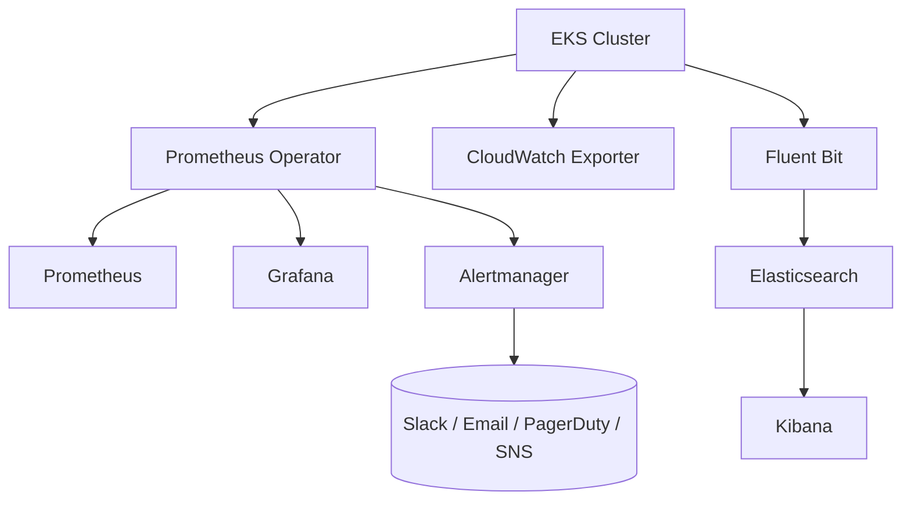

# EKS Observability Stack 🚀  


<div align="center">

[]()  
[]()  
[]()  
[]()  
[]()

</div>

---

## 📘 Overview

This repository provides a **production‑grade EKS cluster observability system** including:

- **Prometheus Operator (kube-prometheus-stack)**
- **Grafana dashboards (SLO/KPI, pod health, resource usage, Prometheus SD health)**
- **CloudWatch Exporter**
- **EFK Stack (Elasticsearch + Fluent Bit + Kibana)**
- **Alerting with Alertmanager (Slack, email, PagerDuty, SNS)**

Based on the steps extracted from the attached document.  
Source: fileciteturn0file0

---

## 🧩 Architecture Diagram



---

## 🔧 Components

### 🟠 1. EKS Cluster Setup
- AWS CLI  
- kubectl  
- eksctl  
- 3-node managed EKS cluster  
- Connectivity verification  

### 🔵 2. Prometheus Operator (kube-prometheus-stack)
- Installed in `monitoring` namespace  
- Custom values: admin password, retention, selectors  
- Includes Prometheus, Grafana, Alertmanager  

### 🟡 3. Grafana Dashboards
Includes recommended panels:
- Prometheus SD health (5xx error rate)  
- Pod restarts (logging, monitoring, kube-system)  
- Running pods by namespace  
- CPU & Memory by namespace  
- Custom SLO dashboards with thresholds  

### 🟣 4. CloudWatch Exporter
- Collects AWS ELB metrics  
- Metrics: Latency, RequestCount  
- ServiceMonitor included  

### 🟤 5. Logging with EFK
- Elasticsearch  
- Kibana (LoadBalancer access)  
- Fluent Bit shipping logs  

### 🔴 6. Alerting with Alertmanager
- Slack integration example  
- Grouping + throttling rules  
- Included upgrade instructions  

---

## 📊 Example Dashboard Panels (PromQL)

### 🔥 Prometheus SD 5xx Error Rate
```promql
(
  sum(rate(prometheus_sd_kubernetes_http_request_total{service="monitoring-kube-prometheus-prometheus", code=~"5.."}[5m])) /
  sum(rate(prometheus_sd_kubernetes_http_request_total{service="monitoring-kube-prometheus-prometheus"}[5m]))
) * 100
```

### 🚨 Pod Restarts (10 min)
```promql
sum(increase(kube_pod_container_status_restarts_total[10m])) by (namespace, pod)
```

---

## 📂 Repository Structure

```
/eks-observability
│── values-prometheus.yaml
│── prometheus-rules.yaml
│── cloudwatch-config.yaml
│── service-monitor.yaml
│── efk/
│    ├── elasticsearch/
│    ├── kibana/
│    └── fluent-bit/
│── diagrams/
│    └── architecture.mmd
│── README.md
```

---

## 🚀 Deployment Summary

You now have:

✔ Production‑grade EKS  
✔ Prometheus Operator  
✔ Grafana dashboards  
✔ CloudWatch exporter  
✔ EFK centralized logging  
✔ SLO monitoring  
✔ Intelligent alerting  

---

## 📥 Download

A downloadable `README.md` has been generated below.

